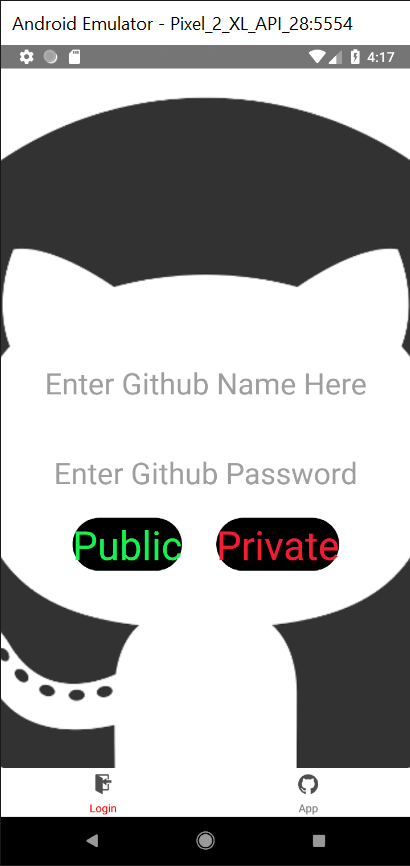
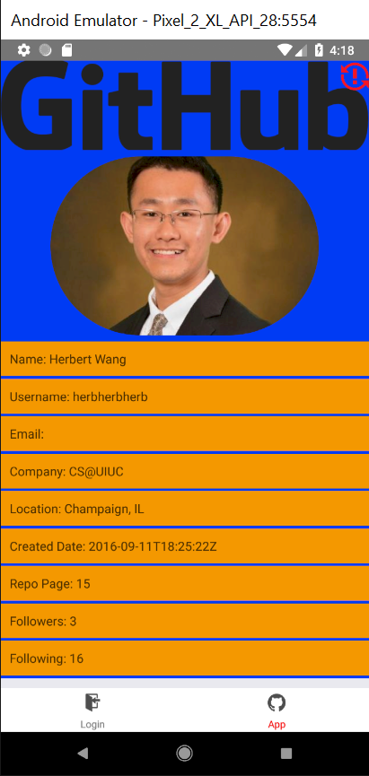
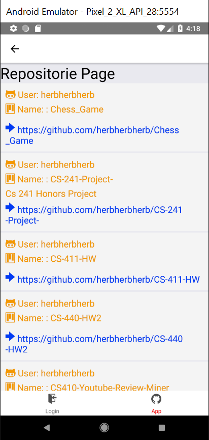
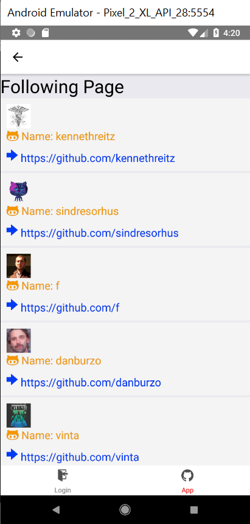
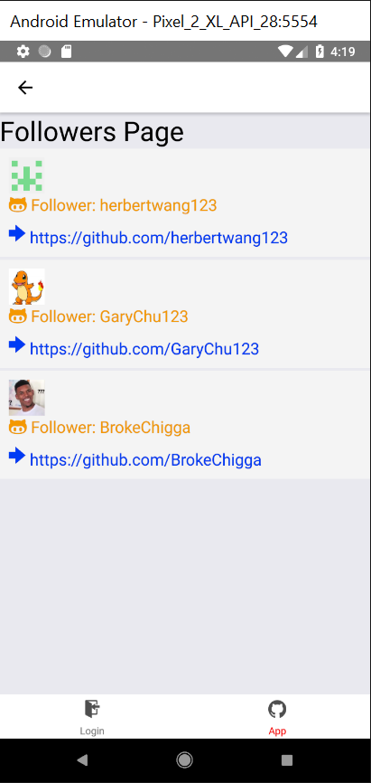

# fa18-cs242-assignment3
## Manual Test Plan
#### Login Page:
1. Login page contains 2 text inputs and 2 buttons, if user fill his/her Github userame, and click "Public button", user should be directed to the corresponding profile page.
2. If user type both the username and its password, then it will authenticate the user and naviagte to profile page if authentication is successful. (Need to be implemented in week 2)
3. Login button at the bottom navigator is color red, and when click App button, it should bring user to App page.

#### Profile Page:
1. Profile page contains the fillowing formatted information: Profile avatar image view, Name, GitHub username, optional Bio, optional Website, optional Email, Public Repos count, Followers count, Following count, Profile create date.
2. The repo page, following page and follower page are clickable, and when clicked, it should bring the user to a new page, and the content has to be about corresponding user in the profile page. 
3. If now go back to login page and login as a different user, the profile page might not get updated,  if so, click the red refresh button at the top-right corner of the page to refresh profile page's content.
4. App button at the bottom navigator is color red, and when click Login button, it should bring user back to Login page.

#### Repositories page:
1. When naviagting from profile page to repositories page, rerepositorie page should display the repo information of the corresponding user from profile page.
2. The rerepositorie page should display repo name, owner's name, owner's avatar, repo description if it has one, and a corresponding url that links to GitHub webpage of the repo.
3. Each cell in the repo page is clickable, and if clicked, it will naviagte the user to profile page with the new user profile infomation.
4. App button at the bottom navigator is color red, and when click Login button, it should bring user back to Login page.

#### Following Page:
1. When naviagting from profile page to following page, following page should display the following repo information of the corresponding user from profile page.
2. The following page should display a list of Gtihub account that the user follow, and each cell in the list contains user's name and avatar, and a corresponding url that links to GitHub webpage of the repo.
3. Each cell in the following page is clickable, and if clicked, it will naviagte the user to profile page with the new userfollowing profile infomation.
4. App button at the bottom navigator is color red, and when click Login button, it should bring user back to Login page.

#### Followers Page:
1. When naviagting from profile page to follower page, follower page should display the follower repo information of the corresponding user from profile page.
2. The follower page should display a list of Gtihub account that follows user, and each cell in the list contains follower's name and avatar, and a corresponding url that links to follower's GitHub webpage.
3. Each cell in the follower page is clickable, and if clicked, it will naviagte the user to profile page with the new follower profile infomation.
4. App button at the bottom navigator is color red, and when click Login button, it should bring user back to Login page.

